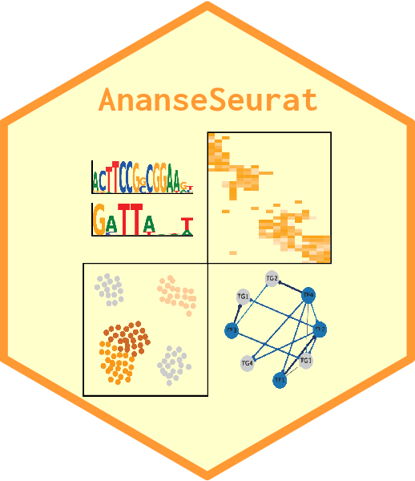

# `AnanseSeurat` package 

<!-- badges: start -->

[](https://github.com/JGASmits/AnanseSeuratWrapper/actions/workflows/R-CMD-check.yaml)
[](https://codecov.io/github/JGASmits/AnanseSeurat)
<!-- badges: end -->

The `AnanseSeurat` package takes pre-processed clustered single cell
objects of scRNAseq and scATACseq or a multiome combination, and
generates files for gene regulatory network (GRN) analysis. For the
vignette see:
<http://htmlpreview.github.io/?https://github.com/JGASmits/AnanseSeurat/blob/main/inst/introduction.html>

## Installation

`AnanseSeurat` can be installed

``` r
library(devtools) # Tools to Make Developing R Packages Easier # Tools to Make Developing R Packages Easier
Sys.unsetenv("GITHUB_PAT")
remotes::install_github("JGASmits/AnanseSeurat@main")
```

### Usage

``` r
library("AnanseSeurat")
rds_file <- './scANANSE/preprocessed_PDMC.Rds'
pbmc <- readRDS(rds_file)
```

Next you can output the data from your single cell object, the file
format, config file and sample file are all ready to automate GRN
analysis using `anansnake`.
<https://github.com/vanheeringen-lab/anansnake>

``` r
export_CPM_scANANSE(
  pbmc,
  min_cells = 25,
  output_dir = './scANANSE/analysis',
  cluster_id = 'predicted.id',
  RNA_count_assay = 'RNA'
)

export_ATAC_scANANSE(
  pbmc,
  min_cells = 25,
  output_dir = './scANANSE/analysis',
  cluster_id = 'predicted.id',
  ATAC_peak_assay = 'peaks'
)

# Specify additional contrasts:
contrasts <-  c('B-naive_B-memory',
                'B-memory_B-naive',
                'B-naive_CD14-Mono',
                'CD14-Mono_B-naive')

config_scANANSE(
  pbmc,
  min_cells = 25,
  output_dir = './scANANSE/analysis',
  cluster_id = 'predicted.id',
  additional_contrasts = contrasts
)

DEGS_scANANSE(
  pbmc,
  min_cells = 25,
  output_dir = './scANANSE/analysis',
  cluster_id = 'predicted.id',
  additional_contrasts = contrasts
)
```

### install and run anansnake

Follow the instructions its respective github page,
<https://github.com/vanheeringen-lab/anansnake> After activating the
conda environment, use the generated files to run GRN analysis using
your single cell cluster data:

``` bash
anansnake \
--configfile scANANSE/analysis/config.yaml \
--resources mem_mb=48_000 --cores 12
```

### import ANANSE results back to your single cell object

After runing Anansnake, you can import the TF influence scores back into
your single cell object of chooiche

``` r
ananse_result_list <- import_seurat_scANANSE(pbmc,
                        cluster_id = 'predicted.id',
                        anansnake_inf_dir= "./scANANSE/analysis/influence")

pbmc <- ananse_result_list[1]
TF_influence_scores <- ananse_result_list[2]
```

### Thanks to:

- Julian A. Arts and his Pycharm equivalent of this package
  <https://github.com/Arts-of-coding/AnanseScanpy>
- Siebren Frohlich and his anansnake implementation
  <https://github.com/vanheeringen-lab/anansnake>
- Rebecca R. Snabel for her implementation of the motif expression
  correlation analysis
- Branco Heuts for testing

# Credits

The hex sticker is generated using the
[`hexSticker`](https://github.com/GuangchuangYu/hexSticker) package.
